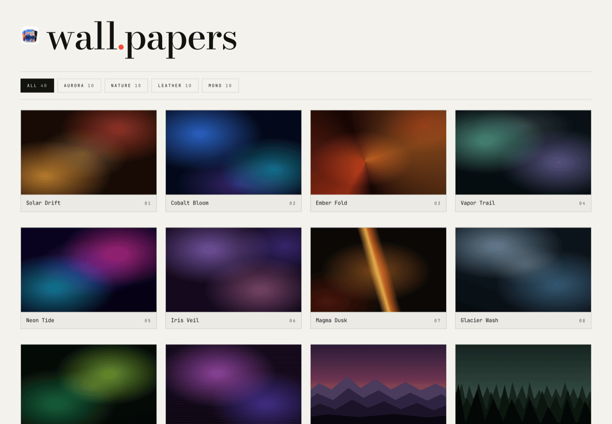
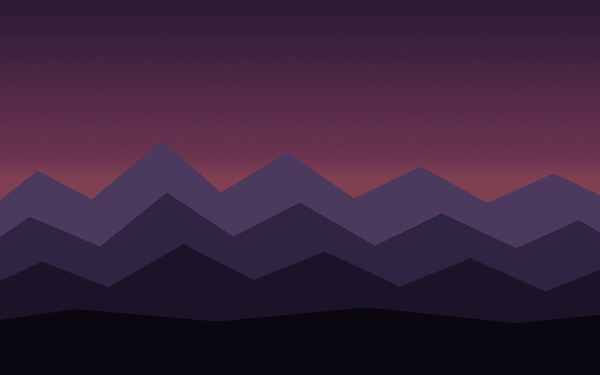
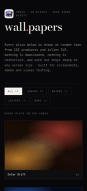

<div align="center">


# Wallpapers

**40 wallpapers. 4 categories. Zero image files.**

**[Open the gallery →](https://wallpapers-roan.vercel.app)**



Every plate is drawn at render time from CSS gradients and inline SVG, so the whole
gallery downloads no images, stays sharp at any resolution, and loads fast enough to be
useful as a backdrop for screenshots, demos and visual regression tests.

[](https://nextjs.org)
[](https://www.typescriptlang.org)
[](https://tailwindcss.com)
[](https://github.com/bunlongheng/wallpapers/actions/workflows/ci.yml)
[](LICENSE)
[](package.json)

</div>

---

## Why it exists

Screenshot and demo work needs backdrops that look good and cost nothing. Stock photos
are megabytes each, need attribution, and blur when you scale them. So this ships no
photos at all: a wallpaper here is a **recipe** - a base colour, a stack of CSS
background layers, and optionally one inline-SVG scene.

| | Photo gallery | This |
|---|---|---|
| Image bytes on the wire | megabytes | 0 |
| Sharp at 5K | needs a 5K source | always |
| Works offline | after caching | immediately |
| Licensing | per photo | MIT, all of it |

Measured against the production build (Next 16.3.5, 2026-09-15):

| | Gzipped |
|---|---|
| Index page, all 40 plates | ~25 KB of HTML |
| One full-screen plate | ~3.6 KB of HTML |
| Images fetched | 0 bytes |
| JavaScript | ~182 KB - the Next.js App Router baseline, not this app |

The catalogue itself never reaches the browser; see
[Why the index ships almost no JavaScript](#why-the-index-ships-almost-no-javascript).

## The categories

| Category | 10 plates of | Examples |
|---|---|---|
| **Aurora** | Radiant gradient meshes and light bloom | Solar Drift, Neon Tide, Magma Dusk |
| **Nature** | Ridgelines, tree cover, dunes and tide | Alpine Dawn, Canyon Cut, Lake Mirror |
| **Leather** | Grain, weave, metal and worked hide | Saddle Tan, Black Carbon, Forged Iron |
| **Mono** | High-contrast black and white cinema | Vanguard, Corridor, Halftone Moon |

<table>
<tr>
<td width="25%"></td>
<td width="25%"></td>
<td width="25%"></td>
<td width="25%"></td>
</tr>
<tr>
<td align="center"><sub><b>Aurora</b> / Solar Drift</sub></td>
<td align="center"><sub><b>Nature</b> / Alpine Dawn</sub></td>
<td align="center"><sub><b>Leather</b> / Saddle Tan</sub></td>
<td align="center"><sub><b>Mono</b> / Vanguard</sub></td>
</tr>
</table>

## Quick start

```bash
git clone https://github.com/bunlongheng/wallpapers.git
cd wallpapers
npm install
npm run dev          # http://localhost:3050
```

No database, no API keys, no services. It runs offline.

## Usage

| Action | How |
|---|---|
| Browse the index | `/` |
| Filter to one category | Click a category chip |
| Open a plate full-bleed | Click it, or go to `/w/<id>` |
| Next / previous plate | `→` / `←` |
| Back to the index | `Esc` |
| Screenshot a plate clean | Open `/w/<id>` and stop moving the pointer - the chrome fades after 5s idle |

Every plate has a stable URL (`/w/solar-drift`, `/w/vanguard`, …) and all 45 pages are
prerendered at build time, which makes them dependable fixtures for a visual-diff suite.



The layout is a single fluid grid: one column on a phone, two on a tablet, three on a
laptop and four on a wide desktop, with the hero type scaling on `clamp()`. The viewer
uses `100dvh` so mobile browser chrome never clips it, and an e2e test asserts the page
never scrolls sideways at 390px.

<br clear="right">

## How a wallpaper is defined

One entry in `lib/wallpapers.ts` is the whole thing:

```ts
{
  id: "alpine-dawn",
  name: "Alpine Dawn",
  category: "nature",
  note: "First light on a cold ridgeline.",
  base: "#1b1220",
  scene: "peaks",                                         // optional inline-SVG scene
  palette: ["#0a0710", "#1b1428", "#2e2440", "#4a3a5c"],  // front-most colour first
  grain: 0.05,                                            // film-grain opacity
  layers: [
    { image: "linear-gradient(180deg, #2a1a36 0%, #6b3350 42%, #d0714f 72%, #f2ac6b 100%)" },
    blob("rgba(255,214,150,0.55)", "50%", "78%", "44% 30%"),   // the low sun
  ],
}
```

`blob()` and `vignette()` are the two layer helpers in `lib/recipes/types.ts`; anything
else is a plain CSS gradient string.

Three rules keep it honest:

1. **One gradient per layer.** `Wallpaper.tsx` builds `background-image`, `-size`,
   `-position` and `-repeat` as parallel comma lists; two gradients in one layer would
   silently misalign every list after it. Tested at render level, for all 40 plates.
2. **A scene needs a palette, and only takes options its scene reads.** This one the
   *compiler* enforces: `scene`, `palette` and `sceneOptions` are a discriminated union,
   so `scene: "ring"` with a `scale` option, or a scene with no palette, will not build.
3. **Texture opacities live in 0..1.** `grain`, `pebble` and `mottle` are the three
   shared noise tiles - one inline SVG each, rasterised once and reused by all 40 plates.

Adding a wallpaper means adding one object to that array. Nothing else changes.

## Project layout

```
app/
  layout.tsx          fonts, metadata, manifest
  page.tsx            the index - server-rendered contact sheet
  w/[id]/page.tsx     one plate, prerendered via generateStaticParams
  not-found.tsx       unknown ids land here
  globals.css         design tokens, the three noise tiles, the CSS category filter
components/
  Wallpaper.tsx       turns one recipe into layered CSS + an optional scene
  Scene.tsx           the 12 inline-SVG scenes (peaks, pines, dunes, helmet, ...)
  CategoryFilter.tsx  the only client component on the index
  Viewer.tsx          full-bleed view: keyboard nav and self-hiding chrome
lib/
  wallpapers.ts       the public entry point - the catalogue and its lookups
  categories.ts       the 4 categories - the client-safe half (see below)
  recipes/
    types.ts          the Recipe model plus the blob() and vignette() layer helpers
    aurora.ts         10 recipes per category, one file each
    nature.ts
    leather.ts
    mono.ts
tests/
  wallpapers.test.ts  catalogue invariants (vitest)
  render.test.tsx     renders every plate and scene, checks the parallel CSS lists
  e2e/gallery.spec.ts navigation, filtering, 404s, mobile overflow, axe (playwright)
```

### Why the index ships almost no JavaScript

The 40 recipes never reach the browser, and the load-bearing detail is the module split:
`CategoryFilter` is the only client component that needs category metadata, and it
imports it from `lib/categories.ts`, never from `lib/wallpapers.ts`. Importing anything
from the recipes module would pull all forty recipes into the bundle with it.

`page.tsx` then renders every tile on the server and hands them to `CategoryFilter` as
`children`; that client component only tracks which chip is active and writes it to a
`data-filter` attribute. One CSS rule, with a selector per category, does the filtering.
The client bundle carries the filter state, not the catalogue.

## Scripts

| Script | Does |
|---|---|
| `npm run dev` | Dev server on :3050 |
| `npm run build` | Production build - prerenders all 45 pages |
| `npm start` | Serve the production build on :3050 |
| `npm run lint` | ESLint (`eslint-config-next`, flat config) |
| `npm run typecheck` | `tsc --noEmit`, strict + `noUncheckedIndexedAccess` |
| `npm test` | Vitest - catalogue invariants |
| `npm run test:watch` | Vitest in watch mode |
| `npm run test:e2e` | Playwright - desktop and iPhone projects, including axe checks |

`npm install` also installs a husky **pre-push** hook that runs typecheck, lint and the
unit tests. The e2e suite is not in the hook (it needs a server); CI runs it against the
production build.

## Environment variables

Nothing is required to run it. These are every value the project reads:

| Variable | Required | Default | Purpose |
|---|---|---|---|
| `NEXT_PUBLIC_SITE_URL` | No | `NEXT_PUBLIC_VERCEL_URL`, else `http://localhost:3050` | Absolute origin for canonical and Open Graph URLs |
| `NEXT_PUBLIC_VERCEL_URL` | No | set by Vercel | Fallback origin when the above is unset. Used bare, so the code prefixes `https://` |
| `PORT` | No | `3050` | Port for `npm start` |
| `CI` | No | unset | Set by CI. Switches Playwright to retries, the GitHub reporter, and the production build |

No secrets exist in this project, so none can leak from it. `.env*` is gitignored except
`.env.example`.

## Deploying

Vercel picks up `vercel.json` as-is:

| Setting | Value |
|---|---|
| Framework | Next.js |
| Install | `npm ci` |
| Build | `npm run build` |
| Output | `.next` |
| Env vars | none required |

Live at **[https://wallpapers-roan.vercel.app](https://wallpapers-roan.vercel.app)**.

```bash
vercel link && vercel --prod
```

Every page is static, so it serves from the edge cache with no server work.

## Security

Set in `next.config.ts` and applied to every response:

- **CSP**: `default-src`, `font-src` and `connect-src` are `'self'`; `img-src` adds
  `data:` for the noise tiles; `frame-src`, `worker-src`, `frame-ancestors` and
  `object-src` are `'none'`. `script-src` and `style-src` are `'self' 'unsafe-inline'` -
  every page is statically prerendered and Next inlines its own hydration payload, so a
  nonce would need per-request middleware that a static site does not have. There is no
  user input on the site. `'unsafe-eval'` is added **only** in the development phase,
  where React's dev build requires it; a production build never carries it, and an e2e
  test asserts that.
- HSTS with preload, `X-Frame-Options: DENY`, `X-Content-Type-Options: nosniff`,
  `Referrer-Policy: strict-origin-when-cross-origin`, and a `Permissions-Policy` that
  denies camera, microphone, geolocation and interest-cohort.
- `poweredByHeader: false`.

The only user input is the `[id]` path segment, and `dynamicParams = false` means an id
outside the catalogue never reaches the renderer - it 404s.

## Accessibility

Scenes are `aria-hidden` decoration. Category chips are real buttons carrying
`aria-pressed`. Every tile link has an accessible name, viewer arrows announce their
destination plate, focus is always visible, and `prefers-reduced-motion` disables the
reveal animation and every transition.

## Notes

The Mono category's armoured-helm plates (Vanguard, Sentry Row, Helm Close) are original
geometry drawn for this project. They are not a likeness of any existing character,
costume or trademarked design.

## Contributing

See [CONTRIBUTING.md](CONTRIBUTING.md) - adding a wallpaper is one object in one array,
and the three rules it has to satisfy are enforced by `npm test`. Security reports go
through [SECURITY.md](SECURITY.md).

## License

[MIT](LICENSE) - Bunlong Heng
