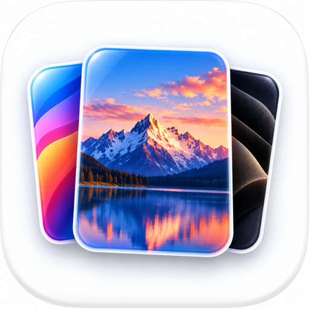

<div align="center">



# Wallpapers

**40 wallpapers. 4 categories. Zero image files.**

Every plate is drawn at render time from CSS gradients and inline SVG, so the whole
gallery downloads no images, stays sharp at any resolution, and loads fast enough to be
useful as a backdrop for screenshots, demos and visual regression tests.

[](https://nextjs.org)
[](https://www.typescriptlang.org)
[](https://tailwindcss.com)
[](LICENSE)
[](package.json)

</div>

---

## Why it exists

Screenshot and demo work needs backdrops that look good and cost nothing. Stock photos
are megabytes each, need attribution, and blur when you scale them. So this ships no
photos at all: a wallpaper here is a **recipe** - a base colour, a stack of CSS
background layers, and optionally one inline-SVG scene.

| | Photo gallery | This |
|---|---|---|
| Image bytes on the wire | megabytes | 0 |
| Sharp at 5K | needs a 5K source | always |
| Works offline | after caching | immediately |
| Licensing | per photo | MIT, all of it |

Measured against the production build:

| | Gzipped |
|---|---|
| Index page, all 40 plates | ~25 KB of HTML |
| One full-screen plate | ~3.6 KB of HTML |
| Images fetched | 0 bytes |
| JavaScript | ~182 KB - the Next.js App Router baseline, not this app |

The catalogue itself never reaches the browser; see
[Why the index ships almost no JavaScript](#why-the-index-ships-almost-no-javascript).

## The categories

| Category | 10 plates of | Examples |
|---|---|---|
| **Aurora** | Radiant gradient meshes and light bloom | Solar Drift, Neon Tide, Magma Dusk |
| **Nature** | Ridgelines, tree cover, dunes and tide | Alpine Dawn, Canyon Cut, Lake Mirror |
| **Leather** | Grain, weave, metal and worked hide | Saddle Tan, Black Carbon, Forged Iron |
| **Mono** | High-contrast black and white cinema | Vanguard, Corridor, Halftone Moon |

## Quick start

```bash
git clone https://github.com/bunlongheng/wallpapers.git
cd wallpapers
npm install
npm run dev          # http://localhost:3050
```

No database, no API keys, no services. It runs offline.

## Usage

| Action | How |
|---|---|
| Browse the index | `/` |
| Filter to one category | Click a category chip |
| Open a plate full-bleed | Click it, or go to `/w/<id>` |
| Next / previous plate | `→` / `←` |
| Back to the index | `Esc` |
| Screenshot a plate clean | Open `/w/<id>` and stop moving the pointer - the chrome fades after 2.6s |

Every plate has a stable URL (`/w/solar-drift`, `/w/vanguard`, …) and all 43 pages are
prerendered at build time, which makes them dependable fixtures for a visual-diff suite.

## How a wallpaper is defined

One entry in `lib/wallpapers.ts` is the whole thing:

```ts
{
  id: "alpine-dawn",
  name: "Alpine Dawn",
  category: "nature",
  note: "First light on a cold ridgeline.",
  base: "#1b1220",
  scene: "peaks",                                   // optional inline-SVG scene
  palette: ["#0a0710", "#1b1428", "#2e2440", "#4a3a5c"],  // front-most colour first
  grain: 0.05,                                      // film-grain opacity
  layers: [
    { image: "linear-gradient(180deg, #2a1a36 0%, #d0714f 72%, #f2ac6b 100%)" },
  ],
}
```

Three rules keep it honest, and the unit tests enforce all three:

1. **One gradient per layer.** `Wallpaper.tsx` builds `background-image`, `-size`,
   `-position` and `-repeat` as parallel comma lists; two gradients in one layer would
   silently misalign every list after it.
2. **A scene needs a palette.** Scenes paint from `palette`, front-most entry first.
3. **Texture opacities live in 0..1.** `grain`, `pebble` and `mottle` are the three
   shared noise tiles - one inline SVG each, rasterised once and reused by all 40 plates.

Adding a wallpaper means adding one object to that array. Nothing else changes.

## Project layout

```
app/
  layout.tsx          fonts, metadata, manifest
  page.tsx            the index - server-rendered contact sheet
  w/[id]/page.tsx     one plate, prerendered via generateStaticParams
  not-found.tsx       unknown ids land here
  globals.css         design tokens, the three noise tiles, the CSS category filter
components/
  Wallpaper.tsx       turns one recipe into layered CSS + an optional scene
  Scene.tsx           the 12 inline-SVG scenes (peaks, pines, dunes, helmet, ...)
  CategoryFilter.tsx  the only client component on the index
  Viewer.tsx          full-bleed view: keyboard nav and self-hiding chrome
lib/
  wallpapers.ts       the 40 recipes and the category list
tests/
  wallpapers.test.ts  catalogue invariants (vitest)
  e2e/gallery.spec.ts navigation, filtering, 404s, mobile overflow (playwright)
```

### Why the index ships almost no JavaScript

The 40 recipes never reach the browser. `page.tsx` renders every tile on the server and
hands them to `CategoryFilter` as `children`; that client component only tracks which
chip is active and writes it to a `data-filter` attribute. Four CSS rules do the
filtering. The client bundle carries the filter state, not the catalogue.

## Scripts

| Script | Does |
|---|---|
| `npm run dev` | Dev server on :3050 |
| `npm run build` | Production build - prerenders all 43 pages |
| `npm start` | Serve the production build on :3050 |
| `npm run lint` | ESLint (`eslint-config-next`, flat config) |
| `npm run typecheck` | `tsc --noEmit`, strict + `noUncheckedIndexedAccess` |
| `npm test` | Vitest - catalogue invariants |
| `npm run test:e2e` | Playwright - desktop and iPhone projects |

## Environment variables

There are none to make it run. `.env.example` documents the one optional value:

| Variable | Required | Default | Purpose |
|---|---|---|---|
| `NEXT_PUBLIC_SITE_URL` | No | Vercel's URL, else `http://localhost:3050` | Absolute origin for canonical and Open Graph URLs |

No secrets exist in this project, so none can leak from it. `.env*` is gitignored except
`.env.example`.

## Deploying

Vercel picks up `vercel.json` as-is:

| Setting | Value |
|---|---|
| Framework | Next.js |
| Install | `npm ci` |
| Build | `npm run build` |
| Output | `.next` |
| Env vars | none required |

```bash
vercel link && vercel --prod
```

Every page is static, so it serves from the edge cache with no server work.

## Security

Set in `next.config.ts` and applied to every response:

- **CSP** locked to `'self'` for scripts, styles, fonts, images and connections;
  `frame-ancestors 'none'`, `object-src 'none'`. `'unsafe-eval'` is added **only** in
  development, where React's dev build requires it.
- HSTS with preload, `X-Frame-Options: DENY`, `X-Content-Type-Options: nosniff`,
  `Referrer-Policy: strict-origin-when-cross-origin`, and a `Permissions-Policy` that
  denies camera, microphone, geolocation and interest-cohort.
- `poweredByHeader: false`.

The only user input is the `[id]` path segment, and `dynamicParams = false` means an id
outside the catalogue never reaches the renderer - it 404s.

## Accessibility

Scenes are `aria-hidden` decoration. Category chips are real buttons carrying
`aria-pressed`. Every tile link has an accessible name, viewer arrows announce their
destination plate, focus is always visible, and `prefers-reduced-motion` disables the
reveal animation and every transition.

## Notes

The Mono category's armoured-helm plates (Vanguard, Sentry Row, Helm Close) are original
geometry drawn for this project. They are not a likeness of any existing character,
costume or trademarked design.

## License

[MIT](LICENSE) - Bunlong Heng
